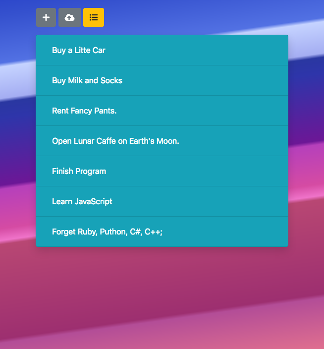
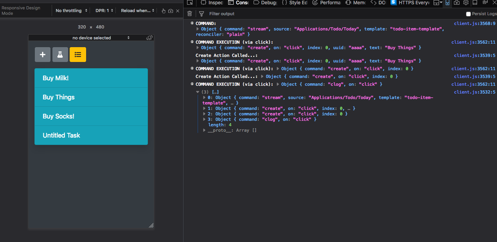

# hurlyburly
Todo Application based on the pookie object tree & cuddlemuffin object store.

## User Interface: Template Reconciler Stream




## HTML

```HTML


<div class="card text-white bg-info shadow">
  <ul data-command="stream --source Applications/Todo/Today --template todo-item-template --reconciler plain | load " class="list-group list-group-flush"></ul>
</div>


<div class="d-none template" id="todo-item-template">
    <li class="list-group-item bg-info text-white">
      <input data-variable="text" type="text" class="form-control todo-text text-white" placeholder="Enter task text">
    </li>
</div>

```


## Client
```JavaScript

const transfusion = require('../../transfusion/client');

const fs = require('fs');
const path = require('path');
const util = require('util');

const port = 8081;
const vfs = fs.readFileSync( path.join(__dirname, '..', 'vfs.txt') ).toString();

const reconcilers = {
  'plain': require('./reconcile.js')
}

transfusion({ vfs, reconcilers, port, })

.on('command.bork', () => {
  console.log('BORK, BORK, BORK!!!');
});

```


## Server

```JavaScript

const transfusion = require('../../transfusion/server');

const fs = require('fs');
const path = require('path');
const util = require('util');

const cuddlemuffinData =  path.join(__dirname, '..', 'cuddlemuffin-data');
const port = 8081;

transfusion({ cuddlemuffinData, port, });

```
